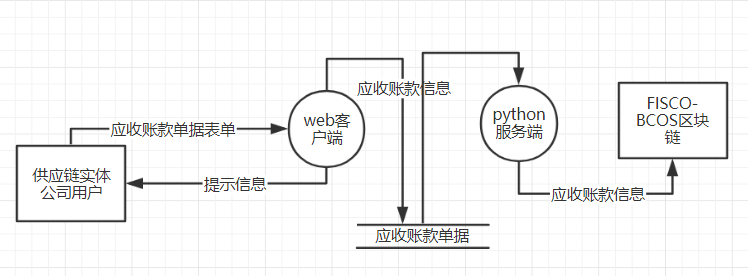

# 中山大学数据科学与计算机学院本科生实验报告

​                                                      **（2019年秋季学期）**

​       课程名称：区块链原理与技术                            任课教师： 郑子彬

| 年级     | 2017        | 专业（方向） | 软件工程         |
| -------- | ----------- | ------------ | ---------------- |
| 学号     | 17343165    | 姓名         | 朱龙威           |
| 电话     | 15013026438 | Email        | 735643857@qq.com |
| 开始日期 | 2019-12-8   | 完成日期     | 2019-12-11       |

[TOC]

## 一、    项目背景

 基于已有的开源区块链系统FISCO-BCOS,以联盟链为主,开发基于区块链或区块链智能合约的供应链金融平台,实现供应链应收账款资产的溯源,流转.

### 开发环境

#### 链端:

- 操作系统:Ubuntu 18.0.4

- 区块链系统:FISCO-BCOS

#### 服务端:

- 操作系统:Ubuntu 18.0.4

- 区块链SDK:python-sdk

- 后端框架:Flask

服务端启动:

参考[VirtualBox宿主机访问虚拟机web服务](<https://blog.csdn.net/hehuii/article/details/102832857>)

虚拟机配置:

virtualbox配置端口转发

全局设定->NAT网络设置->端口转发


配置完成后宿主机上运行的客户端向localhost发送请求会被转发到虚拟机IP:10.0.2.15上

将flask_back.py放在安装配置好的python-sdk目录下,使用终端编译运行即可


#### 客户端:

- 操作系统:windows10系统

- IDE:WebStorm

- web前端框架:Vue-cli

客户端启动:

开发时在vue-client目录下打开终端运行npm run dev,并使用浏览器打开localhost:8080


开发完成后运行npm run build,之后可在dist目录下通过index.html访问

## 二、    方案设计

### 存储设计

合约设计的4个功能接口没有涉及到数据库的存储,而是将数据已单据的形式存储在区块链中,合约中设计的应收账款单据结构体如下:

```solidity
    struct receipt {
        uint loan;
        string lender;
        string borrower;
        uint recordedDate;
        uint payDate;
        bool paid;
    }
```

包含6个字段,借款数额,被借款公司名称,借款公司名称,单据创建日期时间戳,设定还款日期时间戳,是否已付清

### 数据流图



### 核心功能介绍

开发流程

安装下载python-sdk,完成配置python环境和nodejs编译器

使用python-sdk+flask开发后端服务器,使用vue-cli开发前端页面.

#### 前端开发:

客户端跨域请求设置:

当客户端和服务端同时运行在localhost上的不同端口时,客户端向服务端发送的请求为跨域请求,会被Access-Control拦截.

这里使用纯前端的解决方案:

1. 在main.js中设置baseurl

   ```vue
   Vue.use(axios)
   Vue.prototype.$http = axios
   axios.defaults.baseURL = '/api'
   ```

2. 在config/index.js中设置proxyTable

   ```vue
     dev: {
   	...
       proxyTable: {
         '/api':{
           target:'http://localhost:8000',
           changeOrigin:true,
           pathRewrite:{
             '^/api':''
           }
         }
       },
   ```

3. 向服务端发送请求时设置对应url即可

   ```vue
   this.$http.post('/func1/', formData).then(function (res) {
           console.log(res)
         }).catch(function (err) {
           console.log('error:' + err)
         })
   ```

前端核心功能是提供四个合约功能接口按钮

点击功能按钮实现路由跳转,在页面下按照提示输入表单数据(即合约接口函数的参数),然后点击提交按钮发送表单数据到后台,处理成功返回提示信息并返回首页

设计页面.vue文件(存放在目录src/components/下)

以功能一页面为例:

在<template>标签下添加html元素,四个功能页面的主要组成部分是表单

```html
    <form @submit.prevent="submit($event)">
      <p>lender:
        <label><input type="radio" name="lender" value='car' v-model="formMess.lender">car</label>
        <label><input type="radio" name="lender" value='tire' v-model="formMess.lender">tire</label>
        <label><input type="radio" name="lender" value='hub' v-model="formMess.lender">hub</label>
      </p>
      <p>borrower:
        <label><input type="radio" name="borrower" value='car' v-model="formMess.borrower">car</label>
        <label><input type="radio" name="borrower" value='tire' v-model="formMess.borrower">tire</label>
        <label><input type="radio" name="borrower" value='hub' v-model="formMess.borrower">hub</label>
      </p>
      <p>amount:<input type="number" name="amount" v-model="formMess.amount"></p>
      <p>payDate:<input type="date" name="payDate" v-model="formMess.payDate"></p>
      <input type="submit" value="Submit">
    </form>
```

在<script>标签下设置data和methods定义表单提交事件

使用v-model绑定表单字段数据到data,

```js
  data () {
    return {
      formMess: {
        'lender': '',
        'borrower': '',
        'amount': '',
        'payDate': ''
      }
    }
  }
```

给form添加submit.prevent阻止原生的onSubmit事件而转到自定义的submit事件,在submit事件中添加简单的表单数据验证,主要部分是发送http请求,使用post方式提交表单数据并处理响应res

```js
methods: {
    submit: function (event) {
      var formData = new FormData()
      for (var key in this.formMess) {
        if (this.formMess[key] === '') {
          alert('all input must not be empty')
          return
        }
        if (key === 'amount') {
          if (this.formMess[key] <= 0) {
            alert('amount must larger than 0')
            return
          }
        }
        formData.append(key, this.formMess[key])
        console.log(key, this.formMess[key])
      }
      if (this.formMess['lender'] === this.formMess['borrower']) {
        alert('lender and borrower must be different')
        return
      }
      console.log(formData)
      this.$http({
        method: 'post',
        url: '/func1/',
        headers: {
          'Content-Type': 'multipart/form-data'
        },
        withCredentials: true,
        data: formData
      }).then(res => {
        console.log(res)
        if (res.data.result === 'success') {
          alert('合约接口调用成功')
          this.$router.push('/')
        }
      }, err => {
        console.log('error:' + err)
      })
    }
  }
```

设置路由(src/router/index.js)即可实现页面跳转

```js
  routes: [
    {
      path: '/',
      name: 'HomePage',
      component: HomePage
    },
    {
      path: '/func1',
      name: 'func1',
      component: func1
    }
  ]
```

其他功能页面的开发同理

#### 服务端开发:

python后端使用flask框架搭建服务器监听请求并实现handler处理交易请求.

只需要短短几行python代码就可以启动服务器

```python
from flask import Flask
from flask import request

app = Flask(__name__)

@app.route('/', methods=['GET', 'POST'])
def home():
    return '<h1>hello world</h1>'


if __name__ == '__main__':
    app.run()
```

flask框架非常简单,由于本项目并没有实现用户的登录注册以及数据库的存储,所以不需要采用restful的framework以资源为核心设计api服务,只需要让服务器监听特定url 的请求并实现handler处理请求即可

服务端直接与fisco-bcos区块链交互,在启动前需要先启动区块链的节点(在之前的实验中使用一键建链脚本创建),在节点目录运行start_all.sh脚本.

本项目使用python-sdk与区块链交互,python-sdk源码的demo_transaction.py提供了智能合约的部署调用流程:

需要import python-sdk 的包,所以服务端的python程序需要放在python-sdk下运行.主要的包是client.bcosclient的BcosClient

使用`client=BcosClient()`即可实例化区块链控制台

从文件加载abi定义:

```python
if os.path.isfile(client_config.solc_path) or os.path.isfile(client_config.solcjs_path):
    Compiler.compile_file("contracts/Test.sol")
```

合约文件Test.sol需要放在contracts目录下,如果已经编译过可以跳过这步.使用nodejs编译器编译合约会在contracts目录下生成对应的abi和bin文件

部署合约步骤:

```python
abi_file = "contracts/Test.abi"
data_parser = DatatypeParser()
data_parser.load_abi_file(abi_file)
contract_abi = data_parser.contract_abi
# 每次启动服务器部署合约
print("\n>>Deploy:----------------------------------------------------------")
with open("contracts/Test.bin", 'r') as load_f:
    contract_bin = load_f.read()
    load_f.close()
result = client.deploy(contract_bin)
#print("deploy", result)
print("new address : ", result["contractAddress"])
```

通过result["contractAddress"])可以访问部署在区块链上的智能合约并进行接口调用

通过client控制台的call函数可以调用get系列接口,sendRawTransactionGetReceipt函数可以调用需要参数的接口

定义函数callFunction,输入合约接口函数名称字符串和接口参数即可调用合约接口

```python
def callFunction(funcName,args):
    receipt=client.sendRawTransactionGetReceipt(result['contractAddress'],contract_abi,funcName,args)
    print("receipt:",receipt)
    # 解析receipt里的log
    print("\n>>parse receipt and transaction:--------------------------------------")
    txhash = receipt['transactionHash']
    print("transaction hash: ", txhash)
    logresult = data_parser.parse_event_logs(receipt["logs"])
    i = 0
    for log in logresult:
        if 'eventname' in log:
            i = i + 1
            print("{}): log name: {} , data: {}".format(i, log['eventname'], log['eventdata']))
    # 获取对应的交易数据，解析出调用方法名和参数
    txresponse = client.getTransactionByHash(txhash)
    inputresult = data_parser.parse_transaction_input(txresponse['input'])
    print("transaction input parse:", txhash)
    print(inputresult)
    # 解析该交易在receipt里输出的output,即交易调用的方法的return值
    outputresult = data_parser.parse_receipt_output(inputresult['name'], receipt['output'])
    print("receipt output :", outputresult)    
```

输出日志信息和打包区块的信息

使用flask提供api服务很简单,定义router和处理函数即可

```python
@app.route('/func1/', methods=['POST'])
def func1():
    if not request.form:
        abort(400)
    for key in request.form:
        print(key)
        print(request.form[key])
    payDate=request.form['payDate']+' 00:00:00'
    timeArray=time.strptime(payDate,"%Y-%m-%d %H:%M:%S")
    timeStamp=int(time.mktime(timeArray))*1000
    print(timeStamp)
    args=[request.form['lender'],request.form['borrower'],int(request.form['amount']),timeStamp]
    callFunction("AccountReceivableCreate",args)
    return jsonify({'result': 'success'})
```

@app.route设置api服务的url和响应的请求方式

def的func1函数为该路由的handler,首先是验证表单是否为空,如果为空则返回400 Bad Request.如果非空就在服务端打印表单数据,其中前端定义的payDate字段为年月日格式的日期,而合约接受的是13位的unix时间戳,所以使用time和datetime库的函数处理原始的日期字符串如'2019-12-11',格式化转成10位unix时间戳再左移3位即可.处理完成后返回json数据,调用jsonify返回success.

前端接受到的res就可以利用res.data.result访问到响应内容,判断是否请求成功

## 三、    功能测试

### 功能一

前端提示:


后端输出上链日志:


完整输出:

```
lender
tire
borrower
car
amount
1000
payDate
2019-12-11
1575993600000
receipt: {'blockHash': '0x0b0ec364d5aa7e7377d5555d21f902675589fa058a1410204617dab2bb7d2618', 'blockNumber': '0x24', 'contractAddress': '0x0000000000000000000000000000000000000000', 'from': '0x95198b93705e394a916579e048c8a32ddfb900f7', 'gasUsed': '0x26ca9', 'input': '0x6383936e000000000000000000000000000000000000000000000000000000000000008000000000000000000000000000000000000000000000000000000000000000c000000000000000000000000000000000000000000000000000000000000003e80000000000000000000000000000000000000000000000000000016ef089e8000000000000000000000000000000000000000000000000000000000000000004746972650000000000000000000000000000000000000000000000000000000000000000000000000000000000000000000000000000000000000000000000036361720000000000000000000000000000000000000000000000000000000000', 'logs': [{'address': '0x84139e0d46160aa2dd2541f499049095596891c9', 'data': '0x00000000000000000000000000000000000000000000000000000000000003e800000000000000000000000000000000000000000000000000000000000000c000000000000000000000000000000000000000000000000000000000000001000000000000000000000000000000000000000000000000000000016ef33053f60000000000000000000000000000000000000000000000000000016ef089e80000000000000000000000000000000000000000000000000000000000000000000000000000000000000000000000000000000000000000000000000000000004746972650000000000000000000000000000000000000000000000000000000000000000000000000000000000000000000000000000000000000000000000036361720000000000000000000000000000000000000000000000000000000000', 'topics': ['0xf9dc283de72adf65c435f35854dcf89e23507c07c09a56875d74171dca42eef6']}], 'logsBloom': '0x00000000000000000000000000000000000000000000000000010000000000000000000000000000000000000000000000000000000000000000000000100000000000000000000000000000000000000000000000000000000000001000000000000000000000000000000000000000000400000000000000000000000000000000000000000000000000000400000000000000000000000000000000000000000000000000000000000000000000000000000000000000000000000000000000000000000000000040000000000000000000000000000000000000000000000000000000000000000000000000000000000000000000000000000000000000', 'output': '0x', 'status': '0x0', 'to': '0x84139e0d46160aa2dd2541f499049095596891c9', 'transactionHash': '0x154ecdcce2217eb168c0a9d3dd6da44662ff533f78700d582b17e51b0aac40a4', 'transactionIndex': '0x0'}

>>parse receipt and transaction:--------------------------------------
transaction hash:  0x154ecdcce2217eb168c0a9d3dd6da44662ff533f78700d582b17e51b0aac40a4
1): log name: record , data: (1000, 'tire', 'car', 1576038061046, 1575993600000, False)
transaction input parse: 0x154ecdcce2217eb168c0a9d3dd6da44662ff533f78700d582b17e51b0aac40a4
{'name': 'AccountReceivableCreate', 'args': ('tire', 'car', 1000, 1575993600000), 'signature': 'AccountReceivableCreate(string,string,uint256,uint256)'}
receipt output : ()
10.0.2.2 - - [11/Dec/2019 12:21:01] "POST /func1/ HTTP/1.1" 200 -
```

输入被借款公司名,借款公司名,应收账款数目和交付日期

会创建一个单据包含上述信息和签订时间即当前时间的unix时间戳

创建一个应收账款单据,事件日志会记录该单据的信息,并把交易上链

### 功能二

前端提示:


后端输出上链日志:


完整输出:

```
receiptID
1
lender
hub
borrower
tire
amount
500
payDate
2019-12-11
1575993600000
receipt: {'blockHash': '0x59da00c98d81f36a5524298502077876cfa552de15bb25c67465fa08c2b49caa', 'blockNumber': '0x27', 'contractAddress': '0x0000000000000000000000000000000000000000', 'from': '0x95198b93705e394a916579e048c8a32ddfb900f7', 'gasUsed': '0x24b5e', 'input': '0x01c949d5000000000000000000000000000000000000000000000000000000000000000100000000000000000000000000000000000000000000000000000000000000a000000000000000000000000000000000000000000000000000000000000000e000000000000000000000000000000000000000000000000000000000000001f40000000000000000000000000000000000000000000000000000016ef089e8000000000000000000000000000000000000000000000000000000000000000003687562000000000000000000000000000000000000000000000000000000000000000000000000000000000000000000000000000000000000000000000000047469726500000000000000000000000000000000000000000000000000000000', 'logs': [{'address': '0x09d88e27711e78d2c389eb8f532ccdc9abe43077', 'data': '0x00000000000000000000000000000000000000000000000000000000000001f400000000000000000000000000000000000000000000000000000000000000c000000000000000000000000000000000000000000000000000000000000001000000000000000000000000000000000000000000000000000000016ef33c265e0000000000000000000000000000000000000000000000000000016ef089e80000000000000000000000000000000000000000000000000000000000000000000000000000000000000000000000000000000000000000000000000000000003687562000000000000000000000000000000000000000000000000000000000000000000000000000000000000000000000000000000000000000000000000036361720000000000000000000000000000000000000000000000000000000000', 'topics': ['0xf9dc283de72adf65c435f35854dcf89e23507c07c09a56875d74171dca42eef6']}], 'logsBloom': '0x00000000000000000000000000000000000000000000000000010000000000000000000000000000000000000000000000000000000000000000000000000000000000000000000084000000000000000000000000000000000000001000000000000000000000000200000000000000000000000000000000000000000000000000000000000000000000000400000000000000000000000000000000000000000000000000000000000000000000000000000000000000000000000000000000000000000000000000000000000000000000000000000000000000000000000000000000000000000000000000000000000000000000000000000000000000', 'output': '0x', 'status': '0x0', 'to': '0x09d88e27711e78d2c389eb8f532ccdc9abe43077', 'transactionHash': '0x3d188dcffadf88f3b32f860236d088ea5f4789b9843ff69e1ff9e5848fbb44ac', 'transactionIndex': '0x0'}

>>parse receipt and transaction:--------------------------------------
transaction hash:  0x3d188dcffadf88f3b32f860236d088ea5f4789b9843ff69e1ff9e5848fbb44ac
1): log name: record , data: (500, 'hub', 'car', 1576038835806, 1575993600000, False)
transaction input parse: 0x3d188dcffadf88f3b32f860236d088ea5f4789b9843ff69e1ff9e5848fbb44ac
{'name': 'AccountReceivableTransfer', 'args': (1, 'hub', 'tire', 500, 1575993600000), 'signature': 'AccountReceivableTransfer(uint256,string,string,uint256,uint256)'}
receipt output : ()
10.0.2.2 - - [11/Dec/2019 12:33:55] "POST /func2/ HTTP/1.1" 200 -
```

转让,输入单据ID(从1开始编号),新单据信息,会创建一个新单据,旧单据的信息也会被修改,现在是车企各欠轮胎公司和轮毂公司500

### 功能三

前端提示:


后端输出上链日志:


完整输出:

```
receiptID
1
lender
hub
borrower
tire
amount
500
payDate
2019-12-11
1575993600000
receipt: {'blockHash': '0x59da00c98d81f36a5524298502077876cfa552de15bb25c67465fa08c2b49caa', 'blockNumber': '0x27', 'contractAddress': '0x0000000000000000000000000000000000000000', 'from': '0x95198b93705e394a916579e048c8a32ddfb900f7', 'gasUsed': '0x24b5e', 'input': '0x01c949d5000000000000000000000000000000000000000000000000000000000000000100000000000000000000000000000000000000000000000000000000000000a000000000000000000000000000000000000000000000000000000000000000e000000000000000000000000000000000000000000000000000000000000001f40000000000000000000000000000000000000000000000000000016ef089e8000000000000000000000000000000000000000000000000000000000000000003687562000000000000000000000000000000000000000000000000000000000000000000000000000000000000000000000000000000000000000000000000047469726500000000000000000000000000000000000000000000000000000000', 'logs': [{'address': '0x09d88e27711e78d2c389eb8f532ccdc9abe43077', 'data': '0x00000000000000000000000000000000000000000000000000000000000001f400000000000000000000000000000000000000000000000000000000000000c000000000000000000000000000000000000000000000000000000000000001000000000000000000000000000000000000000000000000000000016ef33c265e0000000000000000000000000000000000000000000000000000016ef089e80000000000000000000000000000000000000000000000000000000000000000000000000000000000000000000000000000000000000000000000000000000003687562000000000000000000000000000000000000000000000000000000000000000000000000000000000000000000000000000000000000000000000000036361720000000000000000000000000000000000000000000000000000000000', 'topics': ['0xf9dc283de72adf65c435f35854dcf89e23507c07c09a56875d74171dca42eef6']}], 'logsBloom': '0x00000000000000000000000000000000000000000000000000010000000000000000000000000000000000000000000000000000000000000000000000000000000000000000000084000000000000000000000000000000000000001000000000000000000000000200000000000000000000000000000000000000000000000000000000000000000000000400000000000000000000000000000000000000000000000000000000000000000000000000000000000000000000000000000000000000000000000000000000000000000000000000000000000000000000000000000000000000000000000000000000000000000000000000000000000000', 'output': '0x', 'status': '0x0', 'to': '0x09d88e27711e78d2c389eb8f532ccdc9abe43077', 'transactionHash': '0x3d188dcffadf88f3b32f860236d088ea5f4789b9843ff69e1ff9e5848fbb44ac', 'transactionIndex': '0x0'}

>>parse receipt and transaction:--------------------------------------
transaction hash:  0x3d188dcffadf88f3b32f860236d088ea5f4789b9843ff69e1ff9e5848fbb44ac
1): log name: record , data: (500, 'hub', 'car', 1576038835806, 1575993600000, False)
transaction input parse: 0x3d188dcffadf88f3b32f860236d088ea5f4789b9843ff69e1ff9e5848fbb44ac
{'name': 'AccountReceivableTransfer', 'args': (1, 'hub', 'tire', 500, 1575993600000), 'signature': 'AccountReceivableTransfer(uint256,string,string,uint256,uint256)'}
receipt output : ()
10.0.2.2 - - [11/Dec/2019 12:33:55] "POST /func2/ HTTP/1.1" 200 -
receiptID
1
receipt: {'blockHash': '0x8270be5ee003e299eb769ecf148811c1eaec57fc38ed4c65e57752fc397bd51d', 'blockNumber': '0x28', 'contractAddress': '0x0000000000000000000000000000000000000000', 'from': '0x95198b93705e394a916579e048c8a32ddfb900f7', 'gasUsed': '0x22f0b', 'input': '0xbb88dc240000000000000000000000000000000000000000000000000000000000000001', 'logs': [{'address': '0x09d88e27711e78d2c389eb8f532ccdc9abe43077', 'data': '0x00000000000000000000000000000000000000000000000000000000000001f400000000000000000000000000000000000000000000000000000000000000c000000000000000000000000000000000000000000000000000000000000001000000000000000000000000000000000000000000000000000000016ef33d2cbb0000000000000000000000000000000000000000000000000000016ef089e8000000000000000000000000000000000000000000000000000000000000000000000000000000000000000000000000000000000000000000000000000000000462616e6b0000000000000000000000000000000000000000000000000000000000000000000000000000000000000000000000000000000000000000000000036361720000000000000000000000000000000000000000000000000000000000', 'topics': ['0xf9dc283de72adf65c435f35854dcf89e23507c07c09a56875d74171dca42eef6']}], 'logsBloom': '0x00000000000000000000000000000000000000000000000000010000000000000000000000000000000000000000000000000000000000000000000000000000000000000000000084000000000000000000000000000000000000001000000000000000000000000200000000000000000000000000000000000000000000000000000000000000000000000400000000000000000000000000000000000000000000000000000000000000000000000000000000000000000000000000000000000000000000000000000000000000000000000000000000000000000000000000000000000000000000000000000000000000000000000000000000000000', 'output': '0x', 'status': '0x0', 'to': '0x09d88e27711e78d2c389eb8f532ccdc9abe43077', 'transactionHash': '0x2e100bd065c5d727a1947a0cf235381f2937af53ab74affc4f97be635d200b87', 'transactionIndex': '0x0'}

>>parse receipt and transaction:--------------------------------------
transaction hash:  0x2e100bd065c5d727a1947a0cf235381f2937af53ab74affc4f97be635d200b87
1): log name: record , data: (500, 'bank', 'car', 1576038902971, 1575993600000, False)
transaction input parse: 0x2e100bd065c5d727a1947a0cf235381f2937af53ab74affc4f97be635d200b87
{'name': 'AccountReceivableFinancing', 'args': (1,), 'signature': 'AccountReceivableFinancing(uint256)'}
receipt output : ()
10.0.2.2 - - [11/Dec/2019 12:35:02] "POST /func3/ HTTP/1.1" 200 -
```

根据单据ID找银行融资,让借款公司还钱给银行即可

### 功能四

前端提示:


后端输出上链日志:


完整输出:

```
receiptID
2
receipt: {'blockHash': '0xe6495eb0886c8db44b5f2e2132f1bf84a3a250d5538b7e9440779a546d9ad0c6', 'blockNumber': '0x29', 'contractAddress': '0x0000000000000000000000000000000000000000', 'from': '0x95198b93705e394a916579e048c8a32ddfb900f7', 'gasUsed': '0x22f0b', 'input': '0xbb88dc240000000000000000000000000000000000000000000000000000000000000002', 'logs': [{'address': '0x09d88e27711e78d2c389eb8f532ccdc9abe43077', 'data': '0x00000000000000000000000000000000000000000000000000000000000001f400000000000000000000000000000000000000000000000000000000000000c000000000000000000000000000000000000000000000000000000000000001000000000000000000000000000000000000000000000000000000016ef33e813f0000000000000000000000000000000000000000000000000000016ef089e8000000000000000000000000000000000000000000000000000000000000000000000000000000000000000000000000000000000000000000000000000000000462616e6b0000000000000000000000000000000000000000000000000000000000000000000000000000000000000000000000000000000000000000000000036361720000000000000000000000000000000000000000000000000000000000', 'topics': ['0xf9dc283de72adf65c435f35854dcf89e23507c07c09a56875d74171dca42eef6']}], 'logsBloom': '0x00000000000000000000000000000000000000000000000000010000000000000000000000000000000000000000000000000000000000000000000000000000000000000000000084000000000000000000000000000000000000001000000000000000000000000200000000000000000000000000000000000000000000000000000000000000000000000400000000000000000000000000000000000000000000000000000000000000000000000000000000000000000000000000000000000000000000000000000000000000000000000000000000000000000000000000000000000000000000000000000000000000000000000000000000000000', 'output': '0x', 'status': '0x0', 'to': '0x09d88e27711e78d2c389eb8f532ccdc9abe43077', 'transactionHash': '0x55420d0607fb92132518e718c489d8805afc6a96ff1f8723ea9ccb6e75f861f9', 'transactionIndex': '0x0'}

>>parse receipt and transaction:--------------------------------------
transaction hash:  0x55420d0607fb92132518e718c489d8805afc6a96ff1f8723ea9ccb6e75f861f9
1): log name: record , data: (500, 'bank', 'car', 1576038990143, 1575993600000, False)
transaction input parse: 0x55420d0607fb92132518e718c489d8805afc6a96ff1f8723ea9ccb6e75f861f9
{'name': 'AccountReceivableFinancing', 'args': (2,), 'signature': 'AccountReceivableFinancing(uint256)'}
receipt output : ()
10.0.2.2 - - [11/Dec/2019 12:36:30] "POST /func3/ HTTP/1.1" 200 -
receiptID
2
receipt: {'blockHash': '0xd8438bea8fcf48867fc255596f767d1c78f3968facc7ebbd11ab8922a6e9b514', 'blockNumber': '0x2a', 'contractAddress': '0x0000000000000000000000000000000000000000', 'from': '0x95198b93705e394a916579e048c8a32ddfb900f7', 'gasUsed': '0x6f49', 'input': '0x9bb985c70000000000000000000000000000000000000000000000000000000000000002', 'logs': [{'address': '0x09d88e27711e78d2c389eb8f532ccdc9abe43077', 'data': '0x00000000000000000000000000000000000000000000000000000000000001f400000000000000000000000000000000000000000000000000000000000000c000000000000000000000000000000000000000000000000000000000000001000000000000000000000000000000000000000000000000000000016ef33c265e0000000000000000000000000000000000000000000000000000016ef089e80000000000000000000000000000000000000000000000000000000000000000000000000000000000000000000000000000000000000000000000000000000003687562000000000000000000000000000000000000000000000000000000000000000000000000000000000000000000000000000000000000000000000000036361720000000000000000000000000000000000000000000000000000000000', 'topics': ['0xf9dc283de72adf65c435f35854dcf89e23507c07c09a56875d74171dca42eef6']}], 'logsBloom': '0x00000000000000000000000000000000000000000000000000010000000000000000000000000000000000000000000000000000000000000000000000000000000000000000000084000000000000000000000000000000000000001000000000000000000000000200000000000000000000000000000000000000000000000000000000000000000000000400000000000000000000000000000000000000000000000000000000000000000000000000000000000000000000000000000000000000000000000000000000000000000000000000000000000000000000000000000000000000000000000000000000000000000000000000000000000000', 'output': '0x', 'status': '0x0', 'to': '0x09d88e27711e78d2c389eb8f532ccdc9abe43077', 'transactionHash': '0x55dbac82b151f18ef402f911d75884e67a102f25a1aa57138c8e7e88009f51d0', 'transactionIndex': '0x0'}

>>parse receipt and transaction:--------------------------------------
transaction hash:  0x55dbac82b151f18ef402f911d75884e67a102f25a1aa57138c8e7e88009f51d0
1): log name: record , data: (500, 'hub', 'car', 1576038835806, 1575993600000, False)
transaction input parse: 0x55dbac82b151f18ef402f911d75884e67a102f25a1aa57138c8e7e88009f51d0
{'name': 'AccountReceivablePay', 'args': (2,), 'signature': 'AccountReceivablePay(uint256)'}
receipt output : ()
10.0.2.2 - - [11/Dec/2019 12:38:07] "POST /func4/ HTTP/1.1" 200 -
```

根据单据ID支付,如果时间戳满足则isPaid字段会变为true,同时也可用于查看单据信息.

## 四、    界面展示

请见[视频演示](./视频演示.mp4)

### 首页


有四个按钮对应四个功能,点击可路由跳转到对应的功能测试页,底部有用户手册介绍各个功能的实际作用

### 功能测试页


以功能一为例,用户填写表单并提交即可,测试用例中给出了输入的样例

提交成功会跳转回首页

前端有简单的验证,可以确保输入不为空,借款人和被借款人不同,数额为正整数等


## 五、    心得体会

本次项目开发涉及到前后端和链端的开发,遇到的主要困难是FISCO-BCOS提供的sdk不完善和之前设计的合约的局限性.

FISCO-BCOS官方提供的sdk有Java,nodejs和python,但是只有Java有企业级部署工具,nodejs没有详细的文档,连调用例子都没有,要学习只能阅读sdk源码.

而以太坊提供了完善了dapp开发工具,可以非常轻松地使用truffle等搭建框架进行开发.所以要比肩业界前沿还需要丰富底层构建

由于我之前的合约设计只有简单的日志输出,没有用mysql数据库存放应收账款单据的数据,所以这次的项目开发也比较简单,前后端都不需要复杂的功能,提供最基础的交互就可以了

提升空间:

智能合约与数据库交互,单据以表的形式存放在mysql数据库中.服务端和客户端增加用户资源,用户可以注册登录,用户信息存在服务端的本地数据库中(使用djangorestfulframework+sqlite3可以快速搭建)